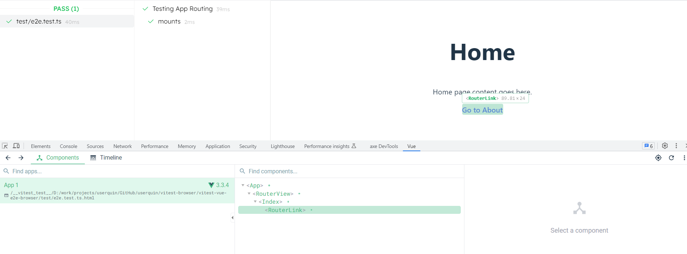

# Vitest Browser Vue 3 e2e

Testing [Vue 3](https://github.com/vuejs/core) application with [@vitest/browser](https://github.com/vitest-dev/vitest) in the browser:
- [vue-router](https://github.com/vuejs/router)
- [unplugin-auto-imports](https://github.com/antfu/unplugin-auto-import)
- [unplugin-vue-components](https://github.com/antfu/unplugin-vue-components) (not working yet)

This repo is using a custom `vitest` and `@vitest/browser` package versions from [this PR](https://github.com/vitest-dev/vitest/pull/3584).

## Run

This repo is using [pnpm](https://pnpm.io) as package manager.

`pnpm install && pnpm test:e2e`

<!--

-->

## Vue DevTools

Vue DevTools is detecting the app inside `@vitest/browser`: `Select component in the page` button not working.

